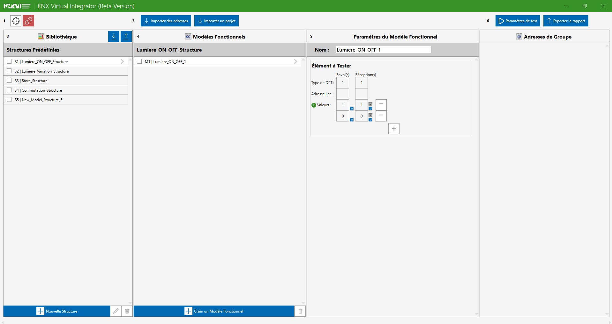
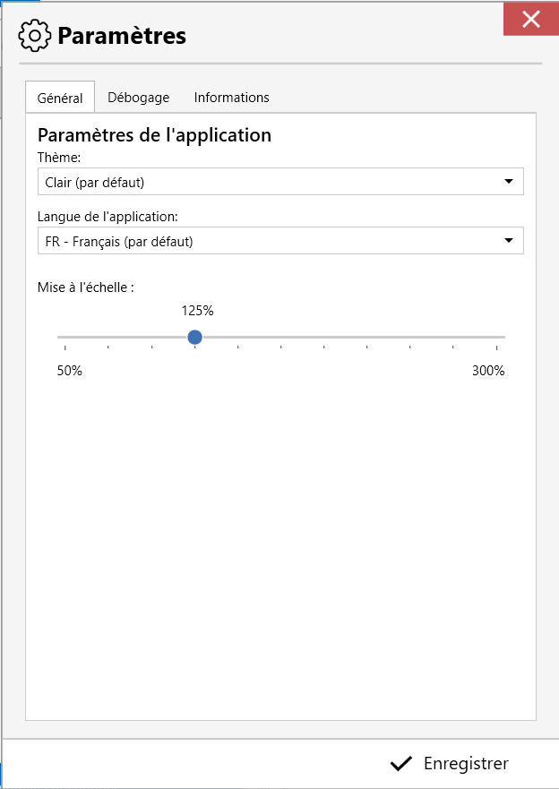
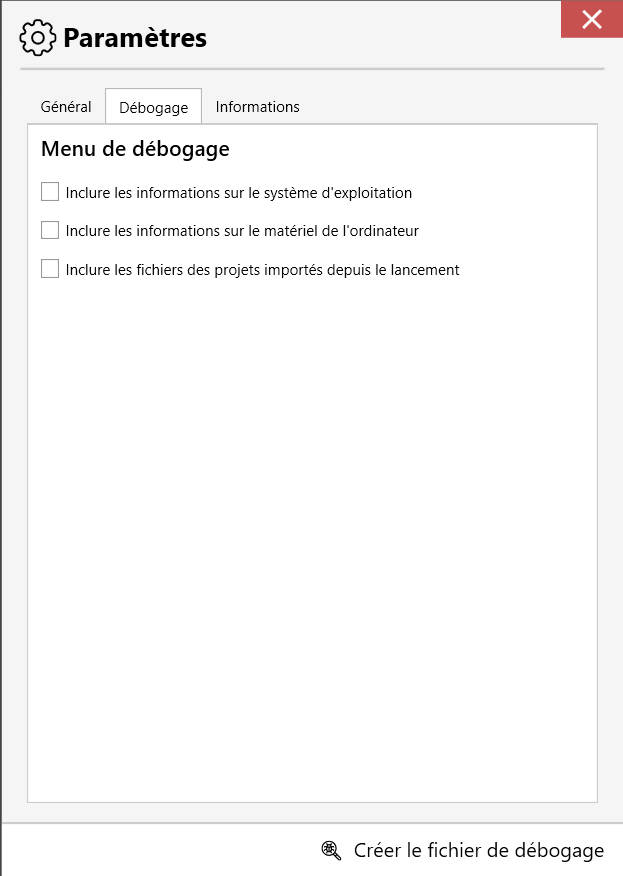
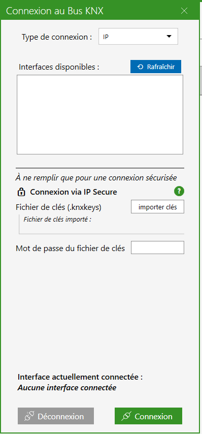
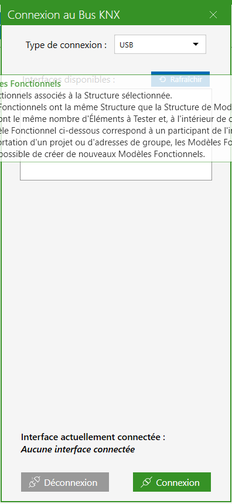
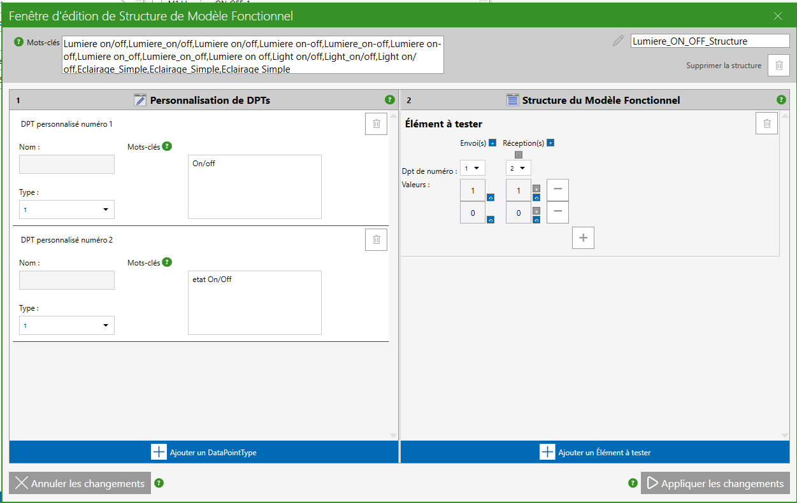
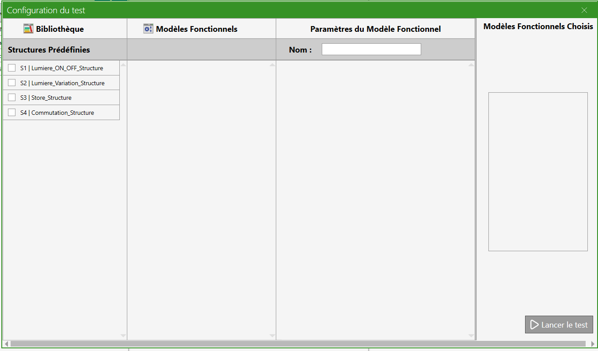
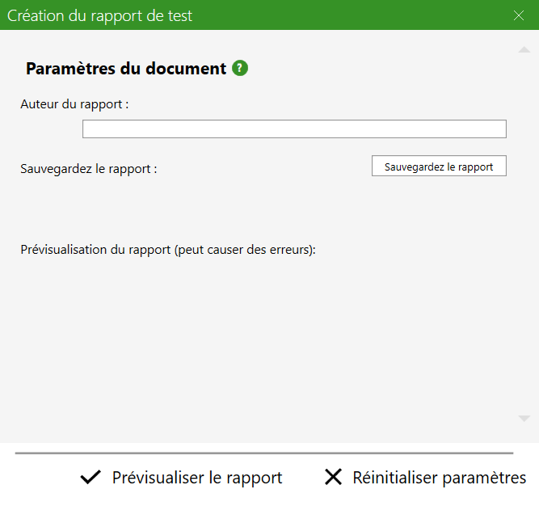
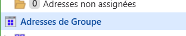

# DOCUMENTATION – KNX Virtual Integrator

## Table of Contents

Last revision : 10/09/2025 (KNX Virtual Integrator v1.3)

## Documentation languages:
- [Français](French_Documentation.md)
- [English](English_Documentation.md)

## Table of Contents
1. 🖥 [Installation](#installation-title)

   1.1. 📥 [Downloading](#downloading)

   1.2. 💻 [Installing](#installing)

2. 🔍 [Application Overview](#overview-title)

   2.1. 🪟 [Main Window](#main-window)

   2.2. ⚙️ [Settings Menu](#settings-window)

   2.3. 🪟 [Connection Window](#connection-window)

   2.4. 🪟 [Structure Editing Window](#structure-window)

   2.5. 🪟 [Analysis Window](#analysis-window)

   2.6. 🪟 [Analysis Report Window](#report-window)

3. 🛠 [Using the Application](#user-title)

   3.1. ⚙️ [Modify Settings](#modify-settings)

   3.2. 📥 [Import from ETS](#ets-import)

   3.3. 🪟️ [Connect to the KNX Bus](#bus-connection)

   3.4. 📝 [Create a Test](#create-test)

   3.5. 🪟 [Run a Test](#launch-test)

   3.6. 🪟 [Generate a Report](#create-report)

   3.7. 📤 [Import/Export KNX VI Projects](#vi-import)

4. 🆘 [FAQ](#faq-title)

[← Back](../README.md)

  
# 1. Installation 
## 1.1 Downloading 

To install the KNX Virtual Integrator application, download the installer [KNX_VI-Installer_vX.X.exe](https://github.com/noecail/UCRM-KNXVirtualIntegrator_2025/releases) from the latest stable release in this GitHub repository.  
The latest version is identified by "Latest" and is usually the highest in the list.

## 1.2 Installing 

To install and launch the application, please follow these steps:

1. **Run the installer**

   Double-click the file `KNX_VI-Installer_vX.X.exe` to launch the installation wizard.

2. **Bypass the “Windows protected your PC” message**

   When the message “Windows protected your PC” appears:

    * Click **"More info"**.
    * Then click **"Run anyway"**. 

   > **Note:** **_This does not mean the application is dangerous._**  
   > This message is generated by **Microsoft Defender SmartScreen**, a built-in Windows security component.  
   > It appears when you try to run an application downloaded from the Internet that is not yet recognized by Microsoft.  
   > It does not mean the application is dangerous, only that it hasn’t been widely downloaded and verified yet.

3. **Allow changes**

   If the system displays a User Account Control (UAC) prompt, click **"Yes"** to allow the app to make changes to your device.

4. **Select the language**

   Choose the installation language from the drop-down menu and click **"OK"**.

5. **Select the application folder**

   The installer will ask where to store the application documents.  
   Changing this folder may cause deletion or modification of important files on the computer since the app removes any non-related files in that directory.  
   It is therefore recommended not to change the default folder.  
   Click **Next** then **Next**.

6. **Create a desktop icon**

   Check the box **"Create a Desktop icon"** if you want a shortcut for KNX Virtual Integrator on your Desktop. Click **"Next"** to continue.

7. **Ready to install**

   A summary window will appear, click **"Install"** to begin installation.

8. **Installation completed**

   Once the installation is finished, you will see a confirmation window.  
   Check **"Run KNX Virtual Integrator"** if you want to launch the app immediately, then click **"Finish"**.

  
# 2. Application Overview 
## 2.1. 🪟 Main Window 

The main window is composed of 5 main sections:

**1. Top Toolbar:**

In this toolbar, you can:
- ⚙️ [Modify application settings](#modify-settings) with the ⚙️ button.
- 📥 [Import KNX group addresses](#ets-import) by clicking on “**Import addresses**”.
- 📥 [Import an ETS project](#ets-import) by clicking on “**Import project**”.
- 📥 [Run installation analysis](#launch-test) by opening the [Analysis Window](#analysis-window) with the “**Test Settings**” button.
- 📤 [Export analysis report](#create-report) by opening the [Report Window](#report-window) with the “**Export report**” button.

**2. First column for Structures:**

Once imported or created, your test structures dictionary appears here. 
You can import/export this dictionary and all created models with the buttons at the top right, in order to save your project, for example. 
Below, the list of created structures is displayed. They can be selected and edited using the bottom toolbar. 
The bottom toolbar has 3 buttons: “**New Structure**”, a pencil to edit the selected structure, and a trash bin to delete checked structures. 
The first and second buttons open the [Structure Editing Window](#structure-window). 
Warning ! “Selected” means the rectangle changes color, while “Checked” means a tick mark appears in the square next to the structure name.

**3. Second column for Models:**

This column displays the models once imported or created.  
Only the list for the selected structure appears. 
You can select, check to delete, or add models. 
The bottom toolbar has 2 buttons: “**Create Functional Model**” and a trash bin to delete checked models. 
The first button adds a new model in the usual structure form but without addresses or sometimes values. 
**Note:** “Selected” means the rectangle changes color, while “Checked” means a tick mark appears in the square next to the model name.

**4. Third column for Test Elements:**

This column displays the test elements of the selected model.  
Here you can rename the model in the “Name:” box, modify group addresses associated with send/receive elements, and adjust values. 
You can increase/decrease the number of values to send/receive as well as modify them. 
Values should be integers, preferably positive. Avoid **-1** for now as it disables the send value. 
Each value has two buttons: top to disable (ignore on receive), bottom to re-enable or reset to 0. 
The “**-**” button removes a row of values, while “**+**” adds one. 

It is not possible to disable send values.

**5. Fourth column – Group Addresses:**

This column shows the group addresses of the imported project and their DPT. 
This display only works when clicking “**Import addresses**” or “**Import project**”. 
If you want to refresh addresses after modifying the dictionary or models without overwriting changes: save the dictionary (see first column), import addresses/project, then re-import the saved dictionary if unwanted changes occurred.

## 2.2. Settings Menu 

There are 4 sections in this window:
- Top right: close button (discard changes).
- Top tabs: General (options), Debug (app bugs), Information (about the app).
- Central area: app settings.
- Bottom: save and close.

Central settings include:
- Theme: Light/Dark.
- Language: French/English fully implemented.
- Scale: resize text and UI objects. May cause layout issues.

Click **"Save"** to apply changes.

## 2.3. Connection Window 

The connexion window can be accessed from the main window by clicking on the **red connection button**.
From there, the communication with the KNX bus can be configured and established.

When the selected connection type is **IP**, the list of available interfaces appears in the central zone.
The **Refresh** button starts a new interface research, and can be useful when there have been research issues.
It is also possible to activate the **secured connection via IP Secure**, but a keys file in the `.knxkeys` format have to be imported and its password filled.
At the bottom of the window, the connection with the bus can be set or removed with respectively **Connection** and **Disconnection** buttons 
The current connection state is displayed in the lower zone of the window. Error messages may appear right above it if the connection cannot be set.

If the **Remote IP (NAT)** option is selected, two more boxes will appear :
the **Router public address** and the **interface individual address**(*1.1.255* by default)
The IP Secure securization remains, with the possibility to import a keys file and to fill the associated password.
Once all the fields have been filled, the connection can be set with the installation by using the **Connection** button.
Error messages will appear above the connection state if any error occurs during the connection.

When the **USB** mode is selected, the application immediately displays all the detected interfaces.
An interface has to be selected and then the **Connection** button can be pressed to initiate the connection.
The **Refresh** button can be pressed to refresh the interfaces if the wanted interfcae doesn't appear.

## 2.4. Structure Editing Window 

As with the other connection modes, the errors will appear in the bottom of the window, as well as the connection states and the **Connection** and **Disconnection** buttons.
Functional models can be created and personalized in this window.

There are two main columns:
- The left one is used for **personnalizing DPTs**.
- The **functional model's structure** can be modified in the right column.

There are two blue buttons at the bottom of the window:
- **Add a DataPointType**, creating a new DPT that can be personalized,
- **Add a Tested Element**, adding a new element to the structure.

### Adding a personalized DataPointType
A new zone appears in the left column when **Add a DataPointType** is clicked.
A personalized DPT is defined by :
- a **name** given by the user,
- a **type** chosen from the list,
- **keywords** to be able to recognize a DPT. To be recognized, the name of the group address must start with one of the keywords.

### Adding a Tested Element
An editing section appears in the right column after clicking on **Add a Tested Element**.
A Tested Element is defined by :
- Associated **DataPointTypes** : chosen from their number, which can be found in the top left corner of the DPT in the left column.
- Whether the DPT is **Sent** or **Received**
- One or more **test values**, added with the **+** button, which will be the values to send and expected. This is an optional part, 

### Validation and cancellation
At the bottom of the window, there are two buttons:
- **Apply changes** to save the structure,
- **Cancel changes** to cancel all the modifications since the last save.
If the structure is not possible, error messages will appear when **Apply changes** is pressed.

## 2.5. Analysis Window 

This window can be accessed by clicking on **Test parameters** in the main window.
The analysis can be configured and started in this window.

In this window, there are 4 columns :
- The **Structures of models** are listed in the column on the left.
- In the second column, the **functional models** corresponding to the selected structure are displayed.
- Specific parameters of a selected functional model can be set in the third column.
- In the last column are displayed all the **functional models selected** for the test.

At the bottom of the window, there are two buttons to **start the test**, or **cancel** it and clear the selected models. 
However, there are view updating issues meaning that the application will untick everything, but the view won't untick previously ticked models.

## 2.6. Analysis Report Window 

This window can be accessed after clicking on **Export report** in the main window.

Analysis result report can be generated here.

There are 3 different zones :
- At the top, there is a field for the **author's name**.
- In the middle, the **saving path** can be selected and there is a button to generate the report.
- At the bottom, there are two buttons to **preview the report** and to **reinitialize** the parameters.

Once generated, the report is exported in a pdf format and can be shared.

  
# 3. Using the Application 
## 3.1. Modify Settings 
In the KNX Virtual Integrator app, there are three main parameters, excluding the possibility to save log archive for debugging.
These three parameters are :
- Clicking on the theme box will display the two available modes: light and dark.
The theme can be selected by just clicking on the desired one. The button at the bottom of the window must be pressed to save the changes.
- The application language: only French and English are fully implemented. English is the default language for all the other languages.
To change it, the procedure is the same as for changing the theme.
- Application scale : to change the application's and texts' sizes. This parameter exists since
the application isn't able to scale automatically, but doesn't always work well.
To change the scale the procedure is to click in the bar on the desired scale, or to slide the button with the mouse. 
Then, the button must be pressed to save it.

The debugging data isn't communicated to anyone. There are only saved in the .zip file.
All the data ticked to be saved will be saved in "debug info" and "latest logs" files.
They can directly be modified to delete sensible data.

## 3.2. Import from ETS 
There are two ways to import group addresses from a KNX project:
- Clicking on **Import addresses** to import a group adresses file in .xml format,
- Clicking on **Import project** to import an entire KNX project in .knxproj format.
When using this option, only the group addresses will be taken from the project. As secured projects cannot be directly imported,
the group addresses must be imported form the group addresses file in .xml format.

The imported group addresses are directly displayed in the last column of the [main window](#main-window).
They are also processed to recognize specific structures. The application takes the addresses and tries 
to recognize their structure and build the associated functional model, by building the tested elements.
They will be associated form their names by recognizing "CMD.." and "IE..".
"Percentage.." will also be associated with "CMD.." and "IE..".
The full method is fully explained in [structure editing window](#structure-window) and [Test creation](#create-test).
  Warning, only projects with 3 levels group addresses can be processed.

Creating a group addresses file in .xml format can be done by opening the group addresses panel in KNX ETS,
then by selecting a group, and by right-clicking on it and clicking on **Export group addresses**.
A window will be open, where .xml format must be chosen at the top right part, as well as the saving path.
Right-clicking on 
and following the same procedure as the one explained above will create a group addresses file with all the address of the project.

Importing a project or group addresses is not mandatory but the title of the project in the report will be
"new project" if nothing is imported.

## 3.3. Connect to the KNX Bus 

## 3.4. Create a Test 

## 3.5. Run a Test 

## 3.6. Generate a Report 

## 3.7. Import/Export KNX VI Projects 

  
# 4. FAQ 

**Why can’t the app be installed for all users at once?** 
Most likely due to folder, permission, and registry key issues,  
the app may never launch when installed outside the user’s AppData folder.

  
[← Back](../README.md)
