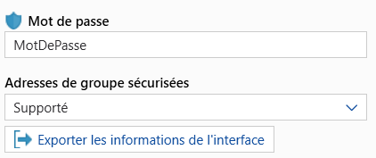
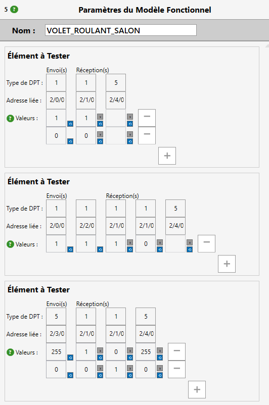

# DOCUMENTATION – KNX Virtual Integrator

## Table of Contents

Last revision : 10/09/2025 (KNX Virtual Integrator v1.3)

## Documentation languages:
- [Français](French_Documentation.md)
- [English](English_Documentation.md)

## Table of Contents
1. 🖥 [Installation](#installation-title)

   1.1. 📥 [Downloading](#downloading)

   1.2. 💻 [Installing](#installing)

2. 🔍 [Application Overview](#overview-title)

   2.1. 🪟 [Main Window](#main-window)

   2.2. ⚙️ [Settings Menu](#settings-window)

   2.3. 🪟 [Connection Window](#connection-window)

   2.4. 🪟 [Structure Editing Window](#structure-window)

   2.5. 🪟 [Analysis Window](#analysis-window)

   2.6. 🪟 [Analysis Report Window](#report-window)

3. 🛠 [Using the Application](#user-title)

   3.1. ⚙️ [Modify Settings](#modify-settings)

   3.2. 📥 [Import from ETS](#ets-import)

   3.3. 🪟️ [Connect to the KNX Bus](#bus-connection)

   3.4. 📝 [Create a Test](#create-test)

   3.5. 🪟 [Run a Test](#launch-test)

   3.6. 🪟 [Generate a Report](#create-report)

   3.7. 📤 [Import/Export KNX VI Projects](#vi-import)

4. 🆘 [FAQ](#faq-title)

[← Back](../README.md)

  
# 1. Installation 
## 1.1 Downloading 

To install the KNX Virtual Integrator application, download the installer [KNX_VI-Installer_vX.X.exe](https://github.com/noecail/UCRM-KNXVirtualIntegrator_2025/releases) from the latest stable release in this GitHub repository.  
The latest version is identified by "Latest" and is usually the highest in the list.

## 1.2 Installing 

To install and launch the application, please follow these steps:

1. **Run the installer**

   Double-click the file `KNX_VI-Installer_vX.X.exe` to launch the installation wizard.

2. **Bypass the “Windows protected your PC” message**

   When the message “Windows protected your PC” appears:

    * Click **"More info"**.
    * Then click **"Run anyway"**. 

   > **Note:** **_This does not mean the application is dangerous._**  
   > This message is generated by **Microsoft Defender SmartScreen**, a built-in Windows security component.  
   > It appears when you try to run an application downloaded from the Internet that is not yet recognized by Microsoft.  
   > It does not mean the application is dangerous, only that it hasn’t been widely downloaded and verified yet.

3. **Allow changes**

   If the system displays a User Account Control (UAC) prompt, click **"Yes"** to allow the app to make changes to your device.

4. **Select the language**

   Choose the installation language from the drop-down menu and click **"OK"**.

5. **Select the application folder**

   The installer will ask where to store the application documents.  
   Changing this folder may cause deletion or modification of important files on the computer since the app removes any non-related files in that directory.  
   It is therefore recommended not to change the default folder.  
   Click **Next** then **Next**.

6. **Create a desktop icon**

   Check the box **"Create a Desktop icon"** if you want a shortcut for KNX Virtual Integrator on your Desktop. Click **"Next"** to continue.

7. **Ready to install**

   A summary window will appear, click **"Install"** to begin installation.

8. **Installation completed**

   Once the installation is finished, you will see a confirmation window.  
   Check **"Run KNX Virtual Integrator"** if you want to launch the app immediately, then click **"Finish"**.

  
# 2. Application Overview 
## 2.1. 🪟 Main Window 

The main window is composed of 5 main sections:

**1. Top Toolbar:**

In this toolbar, you can:
- ⚙️ [Modify application settings](#modify-settings) with the ⚙️ button.
- 🔌️ ️ [Connect to the installation](#connection-window) via USB, IP, ou IP à distance.
- 📥 [Import KNX group addresses](#ets-import) by clicking on “**Import addresses**”. Group addresses from securized projects or not can be imported.
- 📥 [Import an ETS project](#ets-import) by clicking on “**Import project**”. Only the projects without password can be imported.
- 📥 [Run installation analysis](#launch-test) by opening the [Analysis Window](#analysis-window) with the “**Test Settings**” button.
- 📤 [Export analysis report](#create-report) by opening the [Report Window](#report-window) with the “**Export report**” button.

**2. First column for Structures:**

Once imported or created, your test structures dictionary appears here. 
You can import/export this dictionary and all created models with the buttons at the top right, in order to save your project, for example. 
Below, the list of created structures is displayed. They can be selected and edited using the bottom toolbar. 
The bottom toolbar has 3 buttons: “**New Structure**”, a pencil to edit the selected structure, and a trash bin to delete checked structures. 
The first and second buttons open the [Structure Editing Window](#structure-window). 
Warning ! “Selected” means the rectangle changes color, while “Checked” means a tick mark appears in the square next to the structure name.

**3. Second column for Models:**

This column displays the models once imported or created.  
Only the list for the selected structure appears. 
You can select, check to delete, or add models. 
The bottom toolbar has 2 buttons: “**Create Functional Model**” and a trash bin to delete checked models. 
The first button adds a new model in the usual structure form but without addresses or sometimes values. 
**Note:** “Selected” means the rectangle changes color, while “Checked” means a tick mark appears in the square next to the model name.

**4. Third column for Test Elements:**

This column displays the test elements of the selected model.  
Here you can rename the model in the “Name:” box, modify group addresses associated with send/receive elements, and adjust values. 
You can increase/decrease the number of values to send/receive as well as modify them. 
Values should be integers, preferably positive. Avoid **-1** for now as it disables the send value. 
Each value has two buttons: top to disable (ignore on receive), bottom to re-enable or reset to 0. 
The “**-**” button removes a row of values, while “**+**” adds one. 

It is not possible to disable send values.

**5. Fourth column – Group Addresses:**

This column shows the group addresses of the imported project and their DPT. 
This display only works when clicking “**Import addresses**” or “**Import project**”. 
If you want to refresh addresses after modifying the dictionary or models without overwriting changes: save the dictionary (see first column), import addresses/project, then re-import the saved dictionary if unwanted changes occurred.

## 2.2. Settings Menu 

There are 4 sections in this window:
- Top right: close button (discard changes).
- Top tabs: General (options), Debug (app bugs), Information (about the app).
- Central area: app settings.
- Bottom: save and close.

Central settings include:
- Theme: Light/Dark.
- Language: French/English fully implemented.
- Scale: resize text and UI objects. May cause layout issues.

Click **"Save"** to apply changes.

## 2.3. Connection Window 

The connection window can be accessed from the main window by clicking on the **red connection button**.
From there, the communication with the KNX bus can be configured and established.

When the selected connection type is **IP**, the list of available interfaces appears in the central zone.
The **Refresh** button starts a new interface research, and can be useful when there have been research issues.
It is also possible to activate the **secured connection via IP Secure**, but a keys file in the `.knxkeys` format have to be imported and its password filled.
At the bottom of the window, the connection with the bus can be set or removed with respectively **Connection** and **Disconnection** buttons 
The current connection state is displayed in the lower zone of the window. Error messages may appear right above it if the connection cannot be set.

If the **Remote IP (NAT)** option is selected, two more boxes will appear :
the **Router public address** and the **interface individual address**(*1.1.255* by default)
The IP Secure securization remains, with the possibility to import a keys file and to fill the associated password.
Once all the fields have been filled, the connection can be set with the installation by using the **Connection** button.
Error messages will appear above the connection state if any error occurs during the connection.

When the **USB** mode is selected, the application immediately displays all the detected interfaces.
An interface has to be selected and then the **Connection** button can be pressed to initiate the connection.
The **Refresh** button can be pressed to refresh the interfaces if the wanted interfcae doesn't appear.

## 2.4. Structure Editing Window 

As with the other connection modes, the errors will appear in the bottom of the window, as well as the connection states and the **Connection** and **Disconnection** buttons.
Functional models can be created and personalized in this window.

There are two main columns:
- The left one is used for **personnalizing DPTs**.
- The **functional model's structure** can be modified in the right column.

There are two blue buttons at the bottom of the window:
- **Add a DataPointType**, creating a new DPT that can be personalized,
- **Add a Tested Element**, adding a new element to the structure.

### Adding a personalized DataPointType
A new zone appears in the left column when **Add a DataPointType** is clicked.
A personalized DPT is defined by :
- a **name** given by the user,
- a **type** chosen from the list,
- **keywords** to be able to recognize a DPT. To be recognized, the name of the group address must start with one of the keywords.

### Adding a Tested Element
An editing section appears in the right column after clicking on **Add a Tested Element**.
A Tested Element is defined by :
- Associated **DataPointTypes** : chosen from their number, which can be found in the top left corner of the DPT in the left column.
- Whether the DPT is **Sent** or **Received**
- One or more **test values**, added with the **+** button, which will be the values to send and expected. This is an optional part, 

### Validation and cancellation
At the bottom of the window, there are two buttons:
- **Apply changes** to save the structure,
- **Cancel changes** to cancel all the modifications since the last save.
If the structure is not possible, error messages will appear when **Apply changes** is pressed.

## 2.5. Analysis Window 

This window can be accessed by clicking on **Test parameters** in the main window.
The analysis can be configured and started in this window.

In this window, there are 4 columns :
- The **Structures of models** are listed in the column on the left.
- In the second column, the **functional models** corresponding to the selected structure are displayed.
- Specific parameters of a selected functional model can be set in the third column.
- In the last column are displayed all the **functional models selected** for the test.

At the bottom of the window, there are two buttons to **start the test**, or **cancel** it and clear the selected models. 
However, there are view updating issues meaning that the application will untick everything, but the view won't untick previously ticked models.

## 2.6. Analysis Report Window 

This window can be accessed after clicking on **Export report** in the main window.

Analysis result report can be generated here.

There are 3 different zones :
- At the top, there is a field for the **author's name**.
- In the middle, the **saving path** can be selected and there is a button to generate the report.
- At the bottom, there are two buttons to **preview the report** and to **reinitialize** the parameters.

Once generated, the report is exported in a pdf format and can be shared.

  
# 3. Using the Application 
## 3.1. Modify Settings 
In the KNX Virtual Integrator app, there are three main parameters, excluding the possibility to save log archive for debugging.
These three parameters are :
- Clicking on the theme box will display the two available modes: light and dark.
The theme can be selected by just clicking on the desired one. The button at the bottom of the window must be pressed to save the changes.
- The application language: only French and English are fully implemented. English is the default language for all the other languages.
To change it, the procedure is the same as for changing the theme.
- Application scale : to change the application's and texts' sizes. This parameter exists since
the application isn't able to scale automatically, but doesn't always work well.
To change the scale the procedure is to click in the bar on the desired scale, or to slide the button with the mouse. 
Then, the button must be pressed to save it.

The debugging data isn't communicated to anyone. There are only saved in the .zip file.
All the data ticked to be saved will be saved in "debug info" and "latest logs" files.
They can directly be modified to delete sensible data.

## 3.2. Import from ETS 
There are two ways to import group addresses from a KNX project:
- Clicking on **Import addresses** to import a group adresses file in .xml format,
- Clicking on **Import project** to import an entire KNX project in .knxproj format.
When using this option, only the group addresses will be taken from the project. As secured projects cannot be directly imported,
the group addresses must be imported form the group addresses file in .xml format.

The imported group addresses are directly displayed in the last column of the [main window](#main-window).
They are also processed to recognize specific structures. The application takes the addresses and tries 
to recognize their structure and build the associated functional model, by building the tested elements.
They will be associated form their names by recognizing "CMD.." and "IE..".
"Percentage.." will also be associated with "CMD.." and "IE..".
The full method is fully explained in [structure editing window](#structure-window) and [Test creation](#create-test).
  Warning, only projects with 3 levels group addresses can be processed.

Creating a group addresses file in .xml format can be done by opening the group addresses panel in KNX ETS,
then by selecting a group, and by right-clicking on it and clicking on **Export group addresses**.
A window will be open, where .xml format must be chosen at the top right part, as well as the saving path.
Right-clicking on 
and following the same procedure as the one explained above will create a group addresses file with all the address of the project.

Importing a project or group addresses is not mandatory but the title of the project in the report will be
"new project" if nothing is imported.

## 3.3. Connect to the KNX Bus 

The connection with the KNX bus must be set to analyse the KNX installation in the building.
The connection can be set via :
- USB (connection with a cable),
- IP (locally, should be able to connect with IP tunnelling and IP routing, but only few tests have been done),
- IP with NAT/PAT (remotely with a public IP address, with the port 3671, allows IP Secure).

The connection mode can be chosen by selecting the desired option after clicking on the combobox at the top of the window.
Then, the interface must be chosen, and for remote connection, the IP address and the individual address must be filled too.
Warning, some displayed interfaces may not be accessible via KNX VI if they don't have an individual address.
If the interface is an IP Secure interface, a .knxkeys format file and its password must be included and can be exported directly in ETS :

Then, a password must be created in the box above the exportation button to protect the .knxkeys file.
  Warning, if the password above the export button is changed, the application may have to be redownloaded in the KNX device
containing the interface.

Finally, pressing **Enter** or **connection** button initiates the connection.
- If the connection succeeds, a green message will display the interface name, the disconnect button will become red, and the button in
the [main window](#main-window) will be green.
  - If the connection fails, it may have different causes. Some of them have been treated and will display specific error messages.
However, they are only available in french. Here are the issues they cover:
1. Oubli de mettre le fichier knxkeys pour l'IP Secure → The interface is an IP Secure and no .knxkeys file is loaded.
2. Mauvais mot de passe pour le bon fichier knxkeys → The passowrd for the .knxkeys file is wrong.
3. L'interface est déjà utilisée → The interface is already used, so wait or try another interface.
4. Pas d'adresse IP de type IPv4 ou adresse invalide renseignée → The public address given is not valid (when NAT)
5. L'adresse IP n'a pas permis de créer la connexion → The router IP address may be wrong or the app is unable to reach it.
6. Pas d'interface sélectionnée → No interface is selected in the combo box.
7. Interface non reconnue → Please refresh the list and check the plugging.

## 3.4. Create a Test 
In order to verify that the addresses are correctly linked to the good participants, that these participants function
and that the transmission of information is correct in the installation, one must create tests!
 KNX Virtual Integrator allows to create tests which send a command or more and wait for (a) certain value(s) in reception
for a certain amount of time. The success of tests is based on the comparison between the expected value and the received value.
 There are multiple methods and steps to build these tests, they use the 4 columns and the buttons of number 3 present
on the [main window](#main-window).  
The first method is to import without modifying what the software first created. For this method, one should start at step 3
which is to import addresses or an ETS project. Please refer to the [import from ETS](#ets-import) for this step.
(For secured KNX projects, either export the addresses from ETS and import them in KNX VI,
or remove the password in ETS and then import the project in KNX VI. A project secured with a password cannot be imported in KNX VI.)
The steps 4 and 5 are the verification of the good import : the user should manually browse the structures and the models
in order to verify that all the boxes from the 3rd column (or the step 5) of the [main window](#main-window) are correctly filled.

To consider the boxes correctly filled in, all models in a structure should have the same format:
the same number of ‘**tested elements**’, **commands**, **receptions** and **values to send/receive**.
The values should also be the same between the models in the structure, unless they are filled in manually.
 The addresses must be different, but for everything to be filled in correctly, each address box must be filled in.
If any addresses are missing, refer to column 4, i.e. the list of addresses, to fill in the empty boxes by hand.
**Incorrect completion may be caused by missing addresses, incorrectly configured addresses (non-standard names,
missing DPTs, etc.), etc.**

The values must be integers and in decimal code. For example, if the input needs to be text, each letter must be transformed
into its decimal code. The values are preferably positive integers, but we have not taken all cases into account,
so the value **-1** will not cause any problems for testing, but for [KNX VI save](#vi-import), it may cause problems.
Because, among the buttons, it is possible to deactivate the value (the box turns grey and the value goes invisible)
and after the import, each value set to -1 will be automatically deactivated. It is possible to reactivate it by clicking
on the blue button next to the box. The deactivated values correspond to the addresses which a response is expected
but its value is unknown. So the success will be decided only on the presence of the response and not on its value.  
When all the boxes have been verified, it is possible to go to the [test launch](#launch-test).

Another method is the manual filling.  
It is possible to import the addresses or the project and then to suppress everything that was created
(or import a file without DPT so there is no recognition). Not importing makes it impossible to give a name to the project.

1. One should modify the structures or create new ones: open the [structure edit window](#structure-window) and then
add DPTs in the left column and modify their types, they correspond to the list of DPTs which will be present in the
tests of this structure. Then, add tested elements, adjust the number of dispatches/receptions with the buttons next to
"Dispatch(es)" and "Reception(s)", assign them the desired DPTs in dispatch/reception with the combobox. For example,
with an ON/OFF light, two type 1 DPTs should be put, one as a dispatch and the other as a reception.
It is optional, but it is also possible to add default values with the "**+**" and "**-**" on the bottom-right side 
of the element. These values can be modified.
2. Validate the structure, close the edition window and add the desired number of functional models.
3. Select each model to add the group addresses to associate to each DPT. The addresses must be formated the same as
1/250, 1/3/16... Finally, add the values to send and to receive just like in the structure edit window,
the buttons next to the values allow to deactivate them (top button) or set them back to 0 (bottom button). 

The last method combines the first two: start with modifying the structures but this time add keywords to the structure
and to the DPTs. The structure keywords allow you to classify the group addresses as dispatch or reception
in the correct element.  
It is possible to draw inspiration from the keywords already present in the structures predefined by the software
but the recognition is not perfect. Next, one should import addresses, as in the first method, to activate recognition.
You must then check that everything corresponds to the desired tests and complete the boxes or the number of templates if necessary.

## 3.5. Run a Test 
It is the purpose of this software: to test and analyze an installation! To do so, the [test configuration window](#analysis-window)
needs to be opened from the main window.
In this window, **a model's checkbox must be checked** in order to add it to the list of models which will be tested.
It is also possible to check the checkboxes in the column of structures to add all the structure's models to the test.

The tests will be done in the chronological order of addition to the list of models to test. However, if a model is modified
after being added to the list, it will not be updated in the list of models to test.
It needs to be removed from the list by emptying the list or unchecking the model, and then added again.

Now, it is possible to change the delay between each element to slow down the test and not overload the bus.
It is also possible to change the maximal answer timeout allowed for the reception: certain functions might take a longer time
to finish. That is why there is a need to be able to change the timeout.
  Caution, these parameters are general and apply to all the models that will be tested!

In case of a new import, the list of models to be tested will be emptied automatically, but it is also possible to do
it manually using the **Reset selection** button. Finally, to launch the analysis of the list, there is simply need to press
the **Launch Test** button.

During the test, the software is slowed down quite a lot (and functions only in short lapse of time between each command) but
it displays the advancement state of each test with icons: the hourglass means "waiting", the circle means "running" and
the checkmark means "finished" (either successfully or not, same icon). When everything is finished the software returns to its usually state.
  At this moment, it is possible to go to the [Report creation window](#create-report).

## 3.6. Generate a Report 
In order to prove the validity of the installation or to diagnose it, KNX VI makes available the possibility of
generating a PDF document compiling the results from each command sent to the installation.
After a short summary on how the report is filled and the information of the project, each tested model is listed,
with its tested, and the associated commands.
One line in a tested element corresponds to one command line in the report. The successes, failures, responses that show presence
or errors correspond to the fact that what was received in return corresponds or not to what was expected.
Each result corresponds to a reception box.

If the reception value is deactivated, the reception will automatically be a success.

To generate to report, the [report creation window](#report-window) needs to be opened. Then, it is possible to fill in
an author name which will appear in the report, but it is optional. The project name will also appear in the report.
To create and save the report, the **Save the report** button needs to be clicked and then a filename needs to be chosen
in the window that opens. Be careful when replacing a file, as it may already be open somewhere. Finally, you can confirm
your choice and the path where the file is saved will appear in the report window. You can preview the PDF by clicking on
**Preview report**, but this option may cause compatibility issues depending on the PDF readers installed on your computer.

The **Reset parameters** button clears the author name, save path and cancels the preview.
It does not delete the test results nor the report if it has already been saved.

## 3.7. Import/Export KNX VI Projects 
In KNX Virtual Integrator, you have the possibility to export your dictionary of structures, the models and the values and
addresses present in the boxes. The export also includes the name of the project. Saving the addresses from the
[fourth column of the main window](#main-window) is not yet implemented. To display them,
it is advised to first import the addresses and then import the previously exported KNX VI project, in order to get only
the addresses without the automatic recognition which would modify your project.
The test parameters ([test config window](#analysis-window)) are not exportable.

The import overwrites all information present in KNX VI. The user should not forget to save their projects in advance!

The KNX VI project import/export functionality is accessible in the [first column of the main window](#main-window).
It allows for the manual save of your projects. The software does not automatically save and does not warn if it is closed
without a project having been saved. In fact, it is mandator to save/export the project in order to be able to come back to it later.

- In order to successfully complete the export, a file name needs to be chosen. or the default one can be kept.
To ensure a correct export, it is possible to open a file explorer and to look for the exported file.
- For the import, a file name corresponding to a previously exported project needs to be chosen in the dialof window opened
after the use of the export button. Finally, either the entry key needs to be pressed or the file needs to be chosen to finalize the import.

  
# 4. FAQ 

**Why can’t the app be installed for all users at once?** 
Most likely due to folder, permission, and registry key issues,  
the app may never launch when installed outside the user’s AppData folder.

**Why is there no recognition when I import a project/when I import addresses?**
The recognition happens only when group addresses are correctly configured.
A group address is said to be correctly configured when it has a DPT. If the address's name is not standardized,
the recognition will very often be bad. [KNX Boost Desktop](https://github.com/Daichi9764/UCRM) is a software
that makes it possible to rename addresses so they can easily be recognized!

**How could I display the addresses without using the automatic filling of the models?**
Unfortunately, the current version of KNX Virtual Integrator does not allow the possibility of removing the recognition.
However, you may still delete the models that were created after the import, or modify them manually. 

  
[← Back](../README.md)
