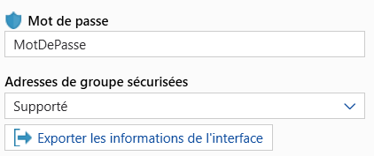
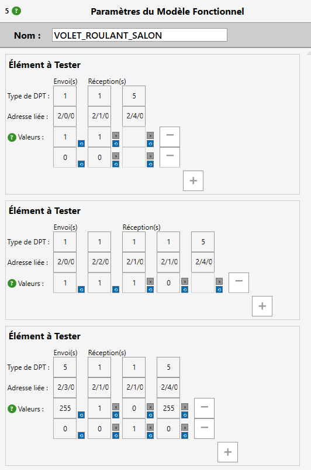
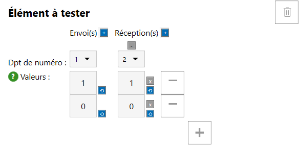

# DOCUMENTATION - KNX Virtual Integrator

Dernière révision : 10/09/2025 (KNX Virtual Integrator v1.3)

## Langues pour la documentation / Documentation language :
- [Français](French_Documentation.md)
- [English](English_Documentation.md)

## Table des matières
1. 🖥 [Installation](#installation-title)

   1.1. 📥 [Téléchargement](#downloading)

   1.2. 💻 [Déroulement de l’installation](#installing)

2. 🔍 [Aperçu de l’application](#overview-title)

   2.1. 🪟 [Fenêtre principale](#main-window)

   2.2. ⚙️ [Menu paramètres](#settings-window)

   2.3. 🪟 [Fenêtre de connection](#Connection-window)

   2.4. 🪟 [Fenêtre d'édition des structures](#structure-window)

   2.5. 🪟 [Fenêtre d'analyse](#analysis-window)

   2.6. 🪟 [Fenêtre de rapport d'analyse](#report-window)

3. 🛠 [Utilisation de l’application](#user-title)

   3.1. ⚙️ [Modifier les paramètres](#modify-settings)

   3.2. 📥 [Importation depuis ETS](#ets-import)

   3.3. 🪟️ [Connexion au bus KNX](#bus-connection)

   3.4. 📝 [Création d'un test](#create-test)

   3.5. 🪟 [Lancement d'un test](#launch-test)

   3.6. 🪟 [Création du rapport](#create-report)

   3.7. 📤 [Import/Export de projets KNX VI](#vi-import)

4. 🆘 [FAQ](#faq-title)

[← Retour](../README.md)

  
# 1. Installation 
## 1.1 Téléchargement 

Pour installer l’application KNX Virtual Integrator, téléchargez l’installateur [KNX_VI-Installer_vX.X.exe](https://github.com/noecail/UCRM-KNXVirtualIntegrator_2025/releases) de la dernière version stable du logiciel dans les releases de ce repository GitHub.
La dernière version est identifiée par "Latest" et est souvent la plus haute dans la liste.

## 1.2 Déroulement de l'installation 

Pour installer et lancer l’application, veuillez suivre les indications suivantes :

1. **Lancez l’installateur**

   Double-cliquez sur le fichier `KNX_VI-Installer_vX.X.exe` pour lancer l’assistant d’installation.

2. **Passez le message “Windows a protégé votre ordinateur”**

   Lorsque le message “Windows a protégé votre ordinateur” s’affiche :

   * Cliquez sur **"Informations complémentaires"**.
   * Cliquez ensuite sur **"Exécuter quand même"**. 

   > **Note :** **_Cela ne signifie pas que l’application est dangereuse._** Ce message est généré par **Microsoft Defender SmartScreen**, un composant de sécurité intégré à Windows. Il s’affiche lorsque vous essayez d’exécuter une application téléchargée depuis Internet qui n’est pas encore reconnue par Microsoft. Cela ne signifie pas que l’application est dangereuse, mais simplement qu’elle n’a pas encore été largement téléchargée et vérifiée par Microsoft.

3. **Autorisez les modifications**

   Si le système affiche une demande de contrôle de compte d’utilisateur (UAC), cliquez sur **"Oui"** pour autoriser l’application à apporter des modifications à votre appareil.

4. **Sélectionnez la langue**

   Choisissez la langue de l’installation dans le menu déroulant et cliquez sur **"OK"**.

5. **Selectionnez l'emplacement de l'application**

   L'installateur va demander où mettre les documments de l'application.
   La modification de ce dossier d'application peut entrainer la suppression ou modification de documents importants de l'ordinateur puisque l'application supprime tout document autre que les siens dans le dossier.
   Il est donc déconseillé de modifier les dossiers par défaut.
   Cliquez sur **Suivant** puis **Suivant**. 

6. **Créer une icône sur le bureau**

   Cochez la case **"Créer une icône sur le Bureau"** si vous voulez créer une icône de l’application KNX Virtual Integrator sur votre Bureau. Cliquez sur **"Suivant"** pour continuer.

7. **Prêt à installer**

   Une fenêtre récapitulative s’affiche, cliquez sur **"Installer"** pour commencer l’installation.

8. **Installation terminée**

   Une fois l’installation terminée, vous verrez une fenêtre de confirmation. Cochez la case **"Exécuter KNX Boost Desktop"** si vous souhaitez démarrer l’application immédiatement, puis cliquez sur **"Terminer"**.

Attention, certaines adresses peuvent ne pas être reconnues et vont dans la structure Unrecognized DPTs.

Il est toujours possible de sauvegarder le dictionnaire de structures créé (avant de faire la reconnaissance) ou 
directement tout ce qui a été créé (après la reconnaissance) avec les boutons d'[import/export de KNX VI](#vi-import).

  
# 2. Aperçu de l'application 
## 2.1. 🪟 Fenêtre principale 

La fenêtre principale est composée de 5 parties principales :

**1. Le bandeau supérieur :**

Dans ce bandeau, vous pouvez :
- ⚙️ [Modifier les paramètres](#modify-settings) de l'application en appuyant sur le bouton ⚙️.
- 📥 [Importer des adresses de groupe KNX](#ets-import) dans l’application en cliquant sur le bouton “**Importer des adresses**”.
- 📥 [Importer un projet ETS](#ets-import) dans l’application en cliquant sur le bouton “**Importer un projet**”.
- 📥 [Lancer une analyse de l'installation](#launch-test) en ouvrant la [fenêtre d'analyse](#analysis-window) avec le bouton "**Paramètres de test**".
- 📤 [Exporter le rapport d'analyse](#create-report) en ouvrant la [fenêtre de rapport](#report-window) avec le bouton "**Exporter le rapport**".

**2. Première colonne des Structures :**

C'est dans cette colonne qu'une fois importé ou créé, votre dictionnaire de structures de test apparait. 
Vous pouvez importer et exporter ce dictionnaire et tous les modèles créés avec les boutons en haut à droite, de manière de sauvegarder le 
projet sur lequel vous travailler, par exemple.  
En dessous, il y a la liste des structures créées. Elles sont sélectionnables et modifiables avec le bandeau inférieur. 
Le bandeau inférieur possède 3 boutons : "**Nouvelle Structure**", Un crayon pour modifier la structure sélectionnée et 
une poubelle pour supprimer les structures cochées dans la liste. 
Le premier et le deuxième bouton ouvrent la [fenêtre d'édition de structure](#structure-window).
  Attention ! "Sélectionné" signifie que le rectangle de la structure change de couleur et "Coché" signifie qu'une 
marque apparait dans le carré à gauche du nom de la structure.

**3. Deuxième colonne des modèles :**

C'est dans cette colonne qu'une fois importées ou créées, les listes des modèles apparaissent.
Seule la liste de la structure sélectionnée apparait.  
Il est possible de sélectionner un modèle, de le cocher pour le supprimer ou d'en rajouter un. 
Le bandeau inférieur possède 2 boutons : "**Créer un Modèle Fonctionnel**" et une poubelle pour supprimer 
les structures cochées dans la liste. 
Le premier bouton rajoute un nouveau modèle dans la liste, de la forme usuelle de la structure mais sans adresse ou parfois de valeurs.
  Attention ! "Sélectionné" signifie que le rectangle de la structure change de couleur et "Coché" signifie qu'une
marque apparait dans le carré à gauche du nom de la structure.

**4. Troisième colonne des éléments de test :**

C'est dans cette colonne que la liste des Éléments de tests du modèle sélectionné apparait.
Il y est possible de renommer le modèle dans la boite à côté de "Nom :", de modifier les adresses de groupes associées
aux envois et aux réceptions des éléments.  
Il est possible d'augmenter le nombre de valeurs à envoyer et à recevoir ainsi que de les modifier.
Il faut mettre les valeurs en entier, préférablement positives. Éviter le -1 pour la version actuelle car cela désactive 
la valeur à envoyer.  
Chaque valeur possède deux boutons : celui du dessus pour la désactiver (ne pas l'observer en cas de réception) 
et celui du dessous pour la réactiver si elle est désactivée ou la remettre à 0 sinon.  
Le bouton avec le signe "**-**" enlève une ligne de valeurs à envoyer ou recevoir, et celui avec le "**+**" en rajoute 
une. 

Il n'est pas possible de désactiver les valeurs à envoyer.

**5. Quatrième colonne des adresses de groupe :**

C'est dans cette colonne que les adresses de groupe du projet importé et leur DPT apparaissent.  
Cet affichage ne fonctionne qu'à l'appui du bouton "**Importer des adresses**" ou du bouton "**Importer un projet**".
Si vous voulez afficher ces adresses après avoir modifié le dictionnaire ou la liste des modèles, et que vous ne voulez 
pas écraser des modifications, il est conseillé de sauvegarder le dictionnaire (Voir boutons de la 1ère colonne) puis
d'importer des adresses ou le projet, puis de importer à nouveau la sauvegarde si des modifications non voulue ont été 
effectuées.

## 2.2. Menu paramètres 

Il y a 4 zone dans cette fenêtre : 
- En haut à droite, le bouton pour fermer la fenêtre et ne pas enregistrer les modifications.
- Le bandeau supérieur avec les onglets de la fenêtre : Général avec les options, Débogage pour les bugs de l'application et Informations sur l'application.
- La zone centrale avec les paramètres de l'application.
- Le bandeau inférieur avec l'enregistrement des paramètres et fermeture de la fenêtre.
La zone centrale permet de choisir :
- Le thème de l'application : Clair/Obscur. 
- La langue de l'application : Seuls le Français et l'Anglais sont complètement implémentés.
- L'échelle de l'application : Permet d'augment ou rétraicir la taille du texte et de tout objet de l'application. Peut causer quelques problèmes.

Il faut bien appuyer sur "**Enregistrer**" pour que les modifications soient prises en compte.

## 2.3. Fenêtre de connexion 

La fenêtre de connexion est accessible depuis la fenêtre principale en cliquant sur le **bouton rouge de connexion**.  
Elle permet de configurer et d’établir la communication avec le bus KNX.

Lorsque le type de connexion choisi est **IP**, la liste des interfaces disponibles apparaît dans la zone centrale.  
Le bouton **Rafraîchir** relance la recherche en cas de problème de détection.  
Il est également possible d’activer la **connexion sécurisée via IP Secure**, qui nécessite l’importation d’un fichier de clés au format `.knxkeys` ainsi que la saisie du mot de passe associé.  
En bas de la fenêtre, les boutons **Connexion** et **Déconnexion** permettent respectivement d’établir ou de couper le lien.  
L’état de la connexion en cours est affiché dans la zone inférieure. Juste au dessus de celle-ci, des messages d'erreur peuvent apparaître quand la connexion ne fonctionne pas comme prévu.

Si l’option **Remote IP (NAT)** est sélectionnée, deux champs supplémentaires apparaissent :  
l’**IP publique du routeur** et l’**adresse individuelle de l’interface** (par défaut de la forme *1.1.255*).  
La sécurisation IP Secure reste disponible, avec la possibilité d’importer un fichier de clés et son mot de passe associé.  
Une fois les informations renseignées, le bouton **Connexion** permet d’établir la communication avec l’installation distante.
Les messages d'erreur de connexion peuvent apparaître au dessus de l'état de connexion quand elle ne fonctionne pas comme prévu.

En choisissant le mode **USB**, l’application affiche directement les interfaces matérielles détectées.  
Il suffit alors de sélectionner celle à utiliser et d’appuyer sur **Connexion**.  
Le bouton **Rafraîchir** permet de relancer la recherche si l’interface n’apparaît pas.  
Comme pour les autres modes, le bas de la fenêtre indique les erreurs, l’état de la connexion et propose les boutons **Connexion** et **Déconnexion**.

## 2.4. Fenêtre d'édition des structures 

La fenêtre d’édition de structure est accessible depuis la fenêtre principale en cliquant sur le bouton **Nouvelle Structure** ou sur l’icône crayon pour modifier une structure existante.  
Elle permet de créer et personnaliser les modèles fonctionnels utilisés lors des tests.

La fenêtre est composée de deux colonnes principales :
- La colonne de gauche est dédiée à la **personnalisation des DPTs**.
- La colonne de droite est réservée à la **structure du modèle fonctionnel**.

En bas de la fenêtre se trouvent deux boutons bleus :
- **Ajouter un DataPointType**, qui ajoute une section pour définir un DPT personnalisé.
- **Ajouter un Élément à tester**, qui permet d’ajouter et de configurer un élément dans la structure.

### Ajout d’un DataPointType personnalisé
Lorsqu’on clique sur **Ajouter un DataPointType**, une nouvelle zone apparaît dans la colonne de gauche.  
Un DPT personnalisé est défini par :
- Un **nom** donné par l’utilisateur.
- Un **type** choisi dans une liste déroulante.
- Des **mots-clés** facilitant la recherche et la catégorisation. Une adresse de groupe doit commencer par un de ces mots-clés pour qu'il soit reconnu.

### Ajout d’un élément à tester
Lorsqu’on clique sur **Ajouter un Élément à tester**, une zone d’édition s’affiche dans la colonne de droite.  
Un élément à tester est défini par :
- Le choix du **DPT associé**. Il se choisit avec son numéro, qui se trouve en haut à gauche du DataPointType personnalisé.
- Son rôle : **Envoi(s)** et/ou **Réception(s)**.
- Une ou plusieurs **valeurs de test**, ajoutées avec le bouton **+**, qui correspondent aux valeurs à envoyer et attendues sur le bus. Cette partie est optionnelle.

### Validation ou annulation
En bas de la fenêtre, deux boutons permettent de gérer la configuration :
- **Appliquer les changements** pour sauvegarder la structure.
- **Annuler les changements** pour revenir à l’état initial sans enregistrer.
Il peut aussi y avoir des messages d'erreur dans le cas où l'édition n'est pas correcte.

## 2.5. Fenêtre d'analyse 

Cette fenêtre est accessible depuis la fenêtre principale en cliquant sur le bouton **Paramètres de test**.  
Elle permet de configurer et lancer une analyse sur les modèles fonctionnels.

Elle se décompose en 4 colonnes :
- La colonne de gauche liste les **structures de modèles**.
- La deuxième colonne affiche les **modèles fonctionnels** liés à la structure sélectionnée.
- La troisième colonne permet de configurer des paramètres spécifiques comme le nom du modèle.
- La colonne de droite regroupe les **modèles choisis pour le test** avec les paramètres de timing (délais entre les éléments, le temps de réponse autorisé avant de passer à un autre test).

En bas de la fenêtre, deux boutons permettent de **lancer le test** ou de l’**annuler**, c'est à dire de remettre aux valeurs par défaut et vider la liste des choisis. L'affichage ne se met pas complètement à jour cependant :
la liste des modèles se met à jour mais les structure cochées et les timings se mettent à jour de manière fonctionnelle mais pas visuellement.

## 2.6. Fenêtre de rapport d'analyse 

Cette fenêtre est accessible depuis la fenêtre principale en cliquant sur le bouton **Exporter le rapport**.  

Elle permet de générer un rapport des résultats d’analyse.

Elle est composée de 3 zones :
- En haut, un champ pour renseigner l’**auteur du rapport**.
- Au centre, une zone pour choisir l’**emplacement de sauvegarde** et générer le rapport.
- En bas, deux options : **prévisualiser le rapport** avant export ou **réinitialiser** les paramètres.

Une fois généré, le rapport est exporté en PDF et peut être partagé.

  
# 3. Utilisation de l'application 
## 3.1. Modifier les paramêtres 
L'application KNX Virtual Integrator permet de changer 3 paramètres principaux, en plus d'autoriser le partage de 
certaines informations pour le débogage. 
Ces 3 paramètres sont : 
- Le thème Clair/Obscur qui se change en cliquant sur la boite correspondant au thème, qui déroule les choix possibles 
et il suffit de cliquer sur le thème préféré. Pour que le changement soit effectif, il faut appuyer sur le bouton en bas de la fenêtre.
- La langue de l'application : seuls le Français et l'Anglais sont supportés complètement (toute autre langue mettra l'application en Anglais).
La mécanique de changement de langue est identique à celle du thème.
- L'échelle de l'application : Elle permet de changer la taille de l'application et de ses textes. Comme l'application
n'est pas capable de se mettre à l'échelle correctement dans tous les cas, ce paramètre a été ajouté mais reste fautif.
Pour changer l'échelle, il est possible de cliquer sur le long de la barre ou de maintenir appuyé la souris sur le bouton 
de la barre et de relacher sur l'échelle voulue. Il faut ensuite valider le choix avec le bouton en bas de la fenêtre.

Les informations de débogages ne sont communiquées à personne sans que vous ne le partagez vous-même puisqu'elle sont 
simplement récoltées dans le fichier .zip. Toutes les informations récoltées avec les cases cochées sont dans les 
fichiers "debug info" et "latest logs". Il vous est possible de les modifier pour supprimer des données que vous 
considéreriez comme sensible.

## 3.2. Importation depuis ETS 
Il est possible d'importer des adresses de groupe depuis KNX ETS de 2 différentes manières : 
- En appuyant sur le bouton "**Importer des adresses**" qui permet d'importer un fichier d'adresses de groupes de type .xml.
- En appuyant sur le bouton "**Importer un projet**" qui permet d'importer un projet de KNX ETS (fichier .knxproj) tout entier, 
bien que seules les adresses sont utilisées. Les projets sécurisés par un mot de passe ne pouvant pas être importés,
il faut alors importer les adresses de groupe (en .xml) de ce projet.

Les adresses de groupe sont utilisées pour l'affichage dans la dernière colonne de la [fenêtre principale](#main-window), 
mais aussi pour la reconnaissance des tests : l'application reconnait les adresses correctement déclarées (avec des DPTs)
et crée des structures et des modèles de tests (regroupements de tests de l'installation) avec ces adresses en comparant leur
noms et leur DPTs . Par exemple : les "CMD.." vont uniquement être liées avec les "IE..", mais s'il y a des DPT de variation, 
les "Pourcentage.." seraient regroupés avec les "CMD.." et les "IE..". 
La méthode de reconnaissance est détaillée dans la [fenêtre d'édition des structures](#structure-window) et la [création d'un test](#create-test).
  Attention, seules les adresses à 3 niveaux peuvent être reconnues.

Pour créer le fichier d'adresses de groupe en .xml, il faut ouvrir le panneau des adresses de groupes sur KNX ETS et 
choisir un groupe ou groupe médian, de cliquer droit dessus et cliquer dans le menu contextuel sur "**Exporter les adresses**" 
et puis de choisir l'option "**XML**" en haut de la fenêtre. Enfin, valider le choix et l'endroit de sauvegarde.
Pour créer le fichier de toutes les adresses, il faut cliquer droit sur :

et répéter les étapes ci-dessus.

L'importation d'un projet et des adresses n'est pas obligatoire mais permet d'inclure le nom du fichier importé comme 
nom de projet, ce qui sera affiché dans le rapport d'analyse. Sans nom de projet, le rapport écrit "Nouveau projet".

## 3.3. Connexion au bus KNX 
Pour analyser l'installation KNX, il faut se connecter au bus KNX. L'application KNX VI permet d'utiliser 3 manières de se 
connecter : 
- En USB (en se connectant au cable)
- En IP (en local, supporte l'IP Secure et est sensé supporter l'IP routing et l'IP tunneling mais peu de tests ont été effectués).
- En IP avec NAT/PAT (à distance avec une adresse publique sur le port 3671, supporte l'IP Secure).

Pour choisir le mode de connexion, il faut ouvrir la liste déroulante en haut de la [fenêtre de connexion](#connection-window) puis de choisir l'option choisie.
Ensuite, renseigner l'adresse IP et l'adresse individuelle de l'interface dans le cas du NAT ou de choisir l'interface voulue dans les autres cas.
Attention, certaines interface proposées peuvent ne pas être accessibles depuis KNX VI si elles ne possèdent pas d'adresse individuelle.
Ensuite, si l'interface utilise IP Secure, il faut  renseigner un fichier .knxkeys qui s'exporte depuis ETS :

Et puis, il faut inclure le mot de passe du fichier .knxkeys (présent au dessus du bouton d'exportation du fichier).
  Attention, si le mot de passe est changé, il peut falloir re-télécharger le programme sur le participant KNX qui 
contient l'interface, pour que le fichier knxkeys fonctionne.

Enfin, il est possible d'appuyer sur la touche "**Entrée**" ou sur le bouton "**Connexion**" pour se connecter.
- Si la connexion fonctionne, un message en vert indiquera le nom de l'interface, le bouton de déconnexion deviendra 
rouge et le bouton dans la [fenêtre principale](#main-window) apparaitra vert.
- Si la connexion échoue, cela peut être à cause de plein de raisons. Nous avons explicité certaines raisons connues et 
remédiables facilement. Ces messages ne sont pour l'instant qu'en Français. La liste des erreurs n'est pas exhaustive :
1. Oubli de mettre le fichier knxkeys pour l'IP Secure → Renseigner les informations nécessaires.
2. Mauvais mot de passe pour le bon fichier knxkeys → Vérifier qu'il s'agit du bon mot de passe téléchargé sur l'interface.
3. L'interface est déjà utilisée → Attendre ou changer d'interface.
4. Pas d'adresse IP de type IPv4 ou adresse invalide renseignée → Donner l'adresse IP publique correspondant à l'interface.
5. L'adresse IP n'a pas permis de créer la connexion → Vérifier qu'il s'agit de la bonne adresse IP et la connexion au/aux routeur.s.
6. Pas d'interface sélectionnée → Bien cliquer sur une interface de la liste proposée dans la fenêtre. Elle doit être surlignée.
7. Interface non reconnue → Rafraichir la liste et vérifier le branchement.

Nous avons déjà rencontré des routeurs auquel on ne peut pas se connecter, mais pas de solution n'a été trouvé.

## 3.4. Création d'un test 
Pour vérifier que les adresses sont bien liées aux bons participants, que ces participants fonctionnent et que la transmission 
d'information est correcte dans l'installation, il faut créer des tests !
 KNX Virtual Integrator permet de créer ces tests qui envoient une commande ou plus et attendent certaine(s) 
valeur(s) en réception pendant un certain temps. La réussite des tests se repose sur la comparaison entre la valeur
attendue et la valeur reçue.
 Il y a plusieurs méthodes et étapes pour construire ces tests, elles utilisent les 4 colonnes et les boutons du numéro 3 
présentes sur la [fenêtre principale](#main-window).  
La première vient de l'importation sans modifier ce qui est créé par l'application. Pour cette méthode, il faut commencer
à l'étape 3 qui est d'importer les adresses ou un projet KNX. Se référer à l'[importation depuis ETS](#ets-import) pour cette étape.
Les étapes 4 et 5 contiennent la vérification de la bonne importation : il faut parcourir à la main les structures et 
les modèles pour vérifier que toutes les cases de la 3e colonne (ou étape 5) de la [fenêtre principale](#main-window) soient correctement remplies.

Pour considérer les cases comme correctement remplies, il faut vérifier que tous les modèles d'une structure possèdent 
la même forme : le même nombre "**d'Éléments de test**", de **commandes**, de **réceptions** et de **valeurs à envoyer/recevoir**.
Les valeurs devraient être aussi les mêmes entre les modèles de la structure tant que ce n'est pas rempli manuellement. 
 Les adresses doivent être différentes mais pour que tout soit correctement rempli, chaque case d'adresse doit être remplie. 
S'il manque des adresses, se référer à la colonne 4, c'est à dire à la liste d'adresses pour remplir les cases vides à la main.
Un mauvais remplissage peut être causé par un manque d'adresses, des adresses mal configurées (des noms non 
normés, des DPTs manquants,...),etc.

Pour les valeurs, elles doivent être des entiers et en code décimal. Par exemple, s'il faut rentrer du texte, il faut transformer 
chaque lettre en son code en décimal. Les valeurs sont préférablement des entiers positifs mais nous n'avons pas pris en 
compte tous les cas donc la valeur **-1** ne posera pas de problème pour les tests mais pour la [sauvegarde KNX VI](vi-import),
elle pourra en poser. Car parmi les boutons, il est possible de désactiver la valeur (bouton gris et la case se grise) 
et après importation, toute valeur à -1 se désactive automatiquement et toute valeur désactivée se met à -1. 
Il est possible de réactiver en cliquant sur le bouton bleu de la case. 
Les valeurs désactivées correspondent aux adresses dont on attend une réponse mais on ne sait pas quelle est la réponse.
Donc le succès ne sera décidé que sur la présence d'une réponse et pas de comparaison sur la valeur.  
Lorsque toutes ces cases ont été vérifiées, il est possible de passer au [lancement de test](#launch-test).

Une autre méthode est le remplissage manuel.   
Il est possible d'importer les adresses ou le projet puis de supprimer tout ce qui est créé (ou d'importer un fichier 
sans DPT pour qu'il n'y ait pas de reconnaissance). Ne pas importer empèche de donner un nom au projet. 

1. Il faut modifier les structures ou en créer des nouvelles : ouvrir la [fenêtre d'édition de structures](#structure-window)
puis ajouter des DPTs dans la colonne de gauche et modifier leurs types, ils correspondent à la liste de DPTs qui seront 
présents dans les tests de cette structure. Ensuite, ajouter des Éléments à tester, ajuster le nombre d'envois/réception
avec les boutons à côté de "Envoi" et "Réception", leur assigner les DPTs voulus en envoi/réception avec la liste 
déroulante. Par exemple, pour une lumière ON/OFF, mettre deux DPTs de type 1 avec un en envoi et un en réception. 
C'est optionnel mais il est possible de rajouter des valeurs par défaut avec les "**+**" et "**-**" en bas à 
droite de l'élément. Ces valeurs peuvent être modifiable. 
2. Valider la structure et fermer la fenêtre d'édition et ajouter le nombre de modèles fonctionnels voulu.
3. Sélectionner chaque modèle pour ajouter les adresses de groupe à associer au DPT. Elles doivent être de la forme 1/250, 
1/3/16, etc. Enfin, ajouter la quantité de valeur à envoyer et recevoir comme dans la fenêtre d'édition de structures, 
les boutons à côté des cases des valeurs permettent de les désactiver (bouton du haut) et les remettre à 0 (bouton du bas). 

La dernière méthode regroupe les deux premières : débuter par la modification des structures mais cette fois en 
rajoutant des mots-clés à la structure et aux DPTs. Les mots-clés de la structure permettent de regrouper les adresses de 
groupe en fonction de leur nom et les mots-clés des DPTs permettent de classer ces adresses en envoi, réception dans le bon élément. 
Il est possible de s'inspirer des mots-clés déjà présents dans les structures de l'application mais la reconnaissance 
n'est pas parfaite. Ensuite, il faut importer des adresses comme dans la première méthode pour activer la reconnaissance.
Il faut alors vérifier que tout correspond aux tests voulus et compléter les cases ou le nombre de modèles si besoin. 

## 3.5. Lancement d'un test 
C'est l'objectif de l'application : tester et analyser une installation ! Pour le faire, il faut ouvrir la [fenêtre de 
d'analyse/test](#analysis-window) depuis la fenêtre principale. 
Dans cette fenêtre, **il faut cocher la case d'un modèle** pour le rajouter à la liste des modèles qui seront testés. 
Il est aussi possible de cocher les cases dans la colonne des structures pour ajouter tous les modèles de la structure au test.

Les tests se feront dans l'ordre chronologique d'ajout dans la liste de modèles à tester. Cependant, si un modèle est 
modifié après avoir été ajouté à la liste, il ne sera pas mis à jour dans la liste des modèles à tester.
Il faudra donc l'enlever de la liste en vidant la liste ou en décochant le modèle, et ensuite l'ajouter de nouveau.

Maintenant, il est possible de changer les délais entre chaque élément pour ralentir le test et ne pas surcharger le bus. 
Il est aussi possible de changer le temps de réponse maximal autorisé pour la réception : certaines fonctions peuvent prendre
du temps avant de se terminer, d'où le besoin de pouvoir le changer. 
  Attention, ces paramètres sont généraux et s'appliquent à tous les modèles qui seront testés !

En cas d'importation la liste est automatiquement vidée, mais il est possible de le faire manuellement avec le bouton "**Réinitialiser sélection**".
Enfin, pour lancer l'analyse de la liste, il faudra tout simplement appuyer sur le bouton "**Lancer le test**". 

Pendant le test, l'application est très ralentie (et ne fonctionne que pendant le court instant entre chaque commande) mais 
elle affiche le stade d'avancement des tests avec des icones : le sablier pour indiquer l'attente, le cercle quand le test
est en cours et la coche quand il est terminé (correctement ou non). Quand tout est terminé l'application reprend son fonctionnement habituel.
  À ce moment, il est possible de passer à la [Création du rapport d'analyse](#create-report).

## 3.6. Création du rapport 
Afin de prouver la validité de l'installation ou d'en faire le diagnostic, KNX VI met à disposition la possibilité de
générer un document PDF compilant les résultats de chaque commande envoyée à l'installation. 
Après un cours résumé sur le remplissage du rapport et les informations du projet, chaque modèle testé est listé, avec
ses éléments de test, et les commandes associées. 
Une ligne d'un élément à tester correspond à une ligne de commande dans le rapport. Les succès, échecs, réponses de présence
ou les erreurs correspondent au fait que ce qui a été reçu en retour correspond ou non à ce qui a été attendu. 
Chaque résultat correspond à une case de réception.

Si la valeur de réception est désactivée, la réception sera automatiquement un succès.

Pour la génération du rapport, il faut ouvrir la [fenêtre de rapport d'analyse](#report-window). Ensuite, il est possible de renseigner 
un nom d'auteur qui apparaitra dans le rapport, mais c'est optionnel. Le nom du projet apparaitra aussi dans le rapport.
Pour créer et sauvegarder le rapport, il faut cliquer sur le bouton "**Sauvegarder le rapport**" et choisir un nom de fichier
dans la fenêtre qui s'est ouverte. Faites attention si vous remplacez un fichier, qu'il ne soit pas déjà ouvert quelque part. 
Enfin, vous pouvez valider votre choix et le chemin où le fichier est sauvegardé apparaitra dans la fenêtre de rapport. 
Il est possible de prévisualiser le pdf en appuyant sur "**Prévisualiser le rapport**" mais cette option peut causer des 
problèmes de compatibilité en fonction des lecteurs de PDF présents sur l'ordinateur. 

Le Bouton **Réinitialiser paramètres** permet de vider le nom d'auteur, le chemin de sauvegarde et donc d'annuler prévisualisation. 
Cela ne supprime pas les résultats de test ni le rapport s'il est déjà sauvegardé.

## 3.7. Import/Export de projets KNX VI 
Dans KNX Virtual Integrator, vous avez la possibilité d'exporter votre dictionnaire de structures, les modèles et 
les valeurs et adresses présentes dans les cases. L'exportation inclue aussi le nom du projet. La sauvegarde des
adresses de groupes de la [colonne 4 de la fenêtre principale](#main-window) n'est pas encore implémentée. 
Pour les afficher, il est possible d'importer les adresses avant d'importer le projet KNX VI précédemment exporté, pour n'avoir que 
les adresses sans la reconnaissance automatique qui modifierait votre projet.
Les paramètres de test ([fenêtre de test](#analysis-window)) ne sont pas exportables.

L'importation écrase toute information présente dans KNX VI. L'utilisateur ne devrait pas oublier de sauvegarder ses projets en avance ! 

La fonctionnalité d'import/export de projets KNX VI est accessible dans la [colonne 1 de la fenêtre principale](#main-window).
Elle permet donc de sauvegarder vos projets manuellement. Le logiciel ne sauvegarde pas automatiquement et ne prévient pas 
s'il est fermé sans qu'il y ait eu de projet sauvegardé. De fait, il est obligatoire de sauvegarder/exporter le projet pour pouvoir le retrouver plus tard.

- Pour mener à bien l'exportation, il faut choisir un nom de fichier ou garder celui par défaut. 
Pour s'assurer de la bonne exportation, il est possible d'ouvrir l'explorateur de fichiers et de chercher le fichier exporté. 
- Pour l'importation, il faut choisir le nom d'un fichier correspondant à un projet précédemment exporté dans la boite 
ouverte après l'utilisation du bouton d'importation. Enfin, il faut appuyer sur entrée ou choisir ce fichier pour finaliser l'importation.

  
# 4. FAQ 

**Pourquoi n'est-il pas possible d'installer l'application pour tous les utilisateurs en même temps ?** 
Probablement à cause de problèmes de dossiers, d'autorisations et de clés de registres, 
l'application peut ne jamais réussir à se lancer lorsqu'elle est installée autre part que dans les AppData de l'utilisateur.

**Pourquoi n'y a-t-il pas de reconnaissance quand j'importe un projet/des adresses ?**
La reconnaissance ne s'effectue que lorsque les adresses de groupes sont bien configurées. 
Une adresse de groupe bien configurée doit posséder un DPT. Si le nom de l'adresse n'est pas normé, 
la reconnaissance sera très souvent mauvaise. [KNX Boost Desktop](https://github.com/Daichi9764/UCRM) est un logiciel
permettant de renommer les adresses pour qu'elles puissent être plus facilement reconnues !

**Comment pourrais-je afficher les adresses sans utiliser le remplissage automatique des modèles ?**
Malheureusement, cette version de KNX Virtual Integrator ne possède pas la possibilité d'enlever la reconnaissance. 
Cependant, vous pouvez toujours supprimer les modèles créés après l'importation, ou les modifier manuellement.

  
[← Retour](../README.md)
