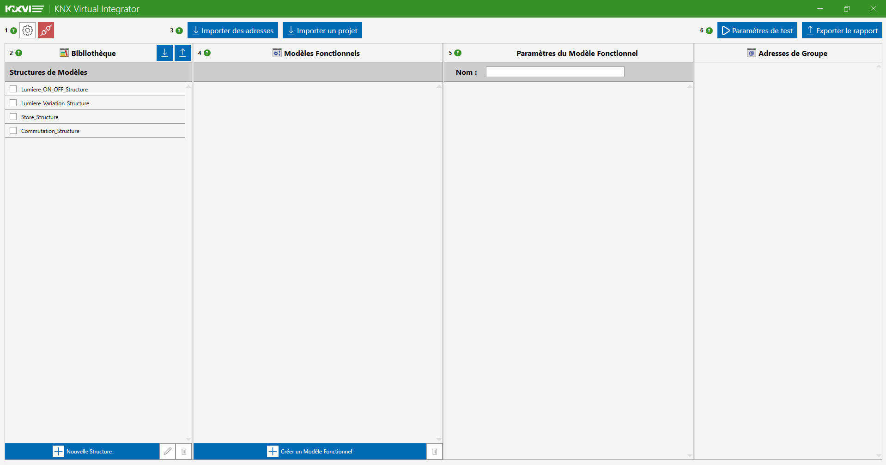

# DOCUMENTATION - KNX Virtual Integrator

Dernière révision : 10/09/2025 (KNX Virtual Integrator v1.3)

## Langues pour la documentation / Documentation language :
- [Français](French_Documentation.md)
- [English](English_Documentation.md)

## Table des matières
1. 🖥 [Installation](#installation-title)

   1.1. 📥 [Téléchargement](#downloading)

   1.2. 💻 [Déroulement de l’installation](#installing)

2. 🔍 [Aperçu de l’application](#overview-title)

   2.1. 🪟 [Fenêtre principale](#main-window)

   2.2. ⚙️ [Menu paramètres](#settings-window)

   2.3. 🪟 [Fenêtre de connection](#Connection-window)

   2.4. 🪟 [Fenêtre d'édition des structures](#structure-window)

   2.5. 🪟 [Fenêtre d'analyse](#analysis-window)

   2.6. 🪟 [Fenêtre de rapport d'analyse](#report-window)

3. 🛠 [Utilisation de l’application](#user-title)

   3.1. ⚙️ [Modifier les paramètres](#modify-settings)

   3.2. 📥 [Importation depuis ETS](#ets-import)

   3.3. 🪟️ [Connexion au bus KNX](#bus-connection)

   3.4. 📝 [Création d'un test](#create-test)

   3.5. 🪟 [Lancement d'un test](#launch-test)

   3.6. 🪟 [Création du rapport](#create-report)

   3.7. 📤 [Import/Export de projets KNX VI](#vi-import)

4. 🆘 [FAQ](#faq-title)

[← Retour](../README.md)

  
# 1. Installation 
## 1.1 Téléchargement 

Pour installer l’application KNX Virtual Integrator, téléchargez l’installateur [KNX_VI-Installer_vX.X.exe](https://github.com/noecail/UCRM-KNXVirtualIntegrator_2025/releases) de la dernière version stable du logiciel dans les releases de ce repository GitHub.
La dernière version est identifiée par "Latest" et est souvent la plus haute dans la liste.

## 1.2 Déroulement de l'installation 

Pour installer et lancer l’application, veuillez suivre les indications suivantes :

1. **Lancez l’installateur**

   Double-cliquez sur le fichier `KNX_VI-Installer_vX.X.exe` pour lancer l’assistant d’installation.

2. **Passez le message “Windows a protégé votre ordinateur”**

   Lorsque le message “Windows a protégé votre ordinateur” s’affiche :

   * Cliquez sur **"Informations complémentaires"**.
   * Cliquez ensuite sur **"Exécuter quand même"**. 

   > **Note :** **_Cela ne signifie pas que l’application est dangereuse._** Ce message est généré par **Microsoft Defender SmartScreen**, un composant de sécurité intégré à Windows. Il s’affiche lorsque vous essayez d’exécuter une application téléchargée depuis Internet qui n’est pas encore reconnue par Microsoft. Cela ne signifie pas que l’application est dangereuse, mais simplement qu’elle n’a pas encore été largement téléchargée et vérifiée par Microsoft.

3. **Autorisez les modifications**

   Si le système affiche une demande de contrôle de compte d’utilisateur (UAC), cliquez sur **"Oui"** pour autoriser l’application à apporter des modifications à votre appareil.

4. **Sélectionnez la langue**

   Choisissez la langue de l’installation dans le menu déroulant et cliquez sur **"OK"**.

5. **Selectionnez l'emplacement de l'application**

   L'installateur va demander où mettre les documments de l'application.
   La modification de ce dossier d'application peut entrainer la suppression ou modification de documents importants de l'ordinateur puisque l'application supprime tout document autre que les siens dans le dossier.
   Il est donc déconseillé de modifier les dossiers par défaut.
   Cliquez sur **Suivant** puis **Suivant**. 

6. **Créer une icône sur le bureau**

   Cochez la case **"Créer une icône sur le Bureau"** si vous voulez créer une icône de l’application KNX Virtual Integrator sur votre Bureau. Cliquez sur **"Suivant"** pour continuer.

7. **Prêt à installer**

   Une fenêtre récapitulative s’affiche, cliquez sur **"Installer"** pour commencer l’installation.

8. **Installation terminée**

   Une fois l’installation terminée, vous verrez une fenêtre de confirmation. Cochez la case **"Exécuter KNX Boost Desktop"** si vous souhaitez démarrer l’application immédiatement, puis cliquez sur **"Terminer"**.

  
# 2. Aperçu de l'application 
## 2.1. 🪟 Fenêtre principale 

La fenêtre principale est composée de 5 parties principales :

**1. Le bandeau supérieur :**

Dans ce bandeau, vous pouvez :
- ⚙️ [Modifier les paramètres](#modify-settings) de l'application en appuyant sur le bouton ⚙️.
- 📥 [Importer des adresses de groupe KNX](#ets-import) dans l’application en cliquant sur le bouton “**Importer des adresses**”.
- 📥 [Importer un projet ETS](#ets-import) dans l’application en cliquant sur le bouton “**Importer un projet**”.
- 📥 [Lancer une analyse de l'installation](#launch-test) en ouvrant la [fenêtre d'analyse](#analysis-window) avec le bouton "**Paramètres de test**".
- 📤 [Exporter le rapport d'analyse](#create-report) en ouvrant la [fenêtre de rapport](#report-window) avec le bouton "**Exporter le rapport**".

**2. Première colonne des Structures :**

C'est dans cette colonne qu'une fois importé ou créé, votre dictionnaire de structures de test apparait. 
Vous pouvez importer et exporter ce dictionnaire et tous les modèles créés avec les boutons en haut à droite, de manière de sauvegarder le 
projet sur lequel vous travailler, par exemple.  
En dessous, il y a la liste des structures créées. Elles sont sélectionnables et modifiables avec le bandeau inférieur. 
Le bandeau inférieur possède 3 boutons : "**Nouvelle Structure**", Un crayon pour modifier la structure sélectionnée et 
une poubelle pour supprimer les structures cochées dans la liste. 
Le premier et le deuxième bouton ouvrent la [fenêtre d'édition de structure](#structure-window).
  Attention ! "Sélectionné" signifie que le rectangle de la structure change de couleur et "Coché" signifie qu'une 
marque apparait dans le carré à gauche du nom de la structure.

**3. Deuxième colonne des modèles :**

C'est dans cette colonne qu'une fois importées ou créées, les listes des modèles apparaissent.
Seule la liste de la structure sélectionnée apparait.  
Il est possible de sélectionner un modèle, de le cocher pour le supprimer ou d'en rajouter un. 
Le bandeau inférieur possède 2 boutons : "**Créer un Modèle Fonctionnel**" et une poubelle pour supprimer 
les structures cochées dans la liste. 
Le premier bouton rajoute un nouveau modèle dans la liste, de la forme usuelle de la structure mais sans adresse ou parfois de valeurs.
  Attention ! "Sélectionné" signifie que le rectangle de la structure change de couleur et "Coché" signifie qu'une
marque apparait dans le carré à gauche du nom de la structure.

**4. Troisième colonne des éléments de test :**

C'est dans cette colonne que la liste des Éléments de tests du modèle sélectionné apparait.
Il y est possible de renommer le modèle dans la boite à côté de "Nom :", de modifier les adresses de groupes associées
aux envois et aux réceptions des éléments.  
Il est possible d'augmenter le nombre de valeurs à envoyer et à recevoir ainsi que de les modifier.
Il faut mettre les valeurs en entier, préférablement positives. Éviter le -1 pour la version actuelle car cela désactive 
la valeur à envoyer.  
Chaque valeur possède deux boutons : celui du dessus pour la désactiver (ne pas l'observer en cas de réception) 
et celui du dessous pour la réactiver si elle est désactivée ou la remettre à 0 sinon.  
Le bouton avec le signe "**-**" enlève une ligne de valeurs à envoyer ou recevoir, et celui avec le "**+**" en rajoute 
une. 

Il n'est pas possible de désactiver les valeurs à envoyer.

**5. Quatrième colonne des adresses de groupe :**

C'est dans cette colonne que les adresses de groupe du projet importé et leur DPT apparaissent.  
Cet affichage ne fonctionne qu'à l'appui du bouton "**Importer des adresses**" ou du bouton "**Importer un projet**".
Si vous voulez afficher ces adresses après avoir modifié le dictionnaire ou la liste des modèles, et que vous ne voulez 
pas écraser des modifications, il est conseillé de sauvegarder le dictionnaire (Voir boutons de la 1ère colonne) puis
d'importer des adresses ou le projet, puis de importer à nouveau la sauvegarde si des modifications non voulue ont été 
effectuées.

## 2.2. Menu paramètres 

Il y a 4 zone dans cette fenêtre : 
- En haut à droite, le bouton pour fermer la fenêtre et ne pas enregistrer les modifications.
- Le bandeau supérieur avec les onglets de la fenêtre : Général avec les options, Débogage pour les bugs de l'application et Informations sur l'application.
- La zone centrale avec les paramètres de l'application.
- Le bandeau inférieur avec l'enregistrement des paramètres et fermeture de la fenêtre.
La zone centrale permet de choisir :
- Le thème de l'application : Clair/Obscur. 
- La langue de l'application : Seuls le Français et l'Anglais sont complètement implémentés.
- L'échelle de l'application : Permet d'augment ou rétraicir la taille du texte et de tout objet de l'application. Peut causer quelques problèmes.

Il faut bien appuyer sur "**Enregistrer**" pour que les modifications soient prises en compte.

## 2.3. Fenêtre de connexion 

## 2.4. Fenêtre d'édition des structures 

## 2.5. Fenêtre d'analyse 

## 2.6. Fenêtre de rapport d'analyse 

  
# 3. Utilisation de l'application 
## 3.1. Modifier les paramêtres 

## 3.2. Importation depuis ETS 

## 3.3. Connexion au bus KNX 

## 3.4. Création d'un test 

## 3.5. Lancement d'un test 
C'est l'objectif de l'application : tester et analyser une installation ! 

## 3.6. Création du rapport 
Afin de prouver la validité de l'installation ou d'en faire le diagnostic, KNX VI met à disposition la possibilité de
générer un document PDF compilant les résultats de chaque commande envoyée à l'installation. 
Après un cours résumé sur le remplissage du rapport et les informations du projet, chaque modèle testé est listé, avec
ses éléments de test, et les commandes associées. 
Une ligne d'un élément à tester correspond à une ligne de commande dans le rapport. Les succès, échecs, réponses de présence
ou les erreurs correspondent au fait que ce qui a été reçu en retour correspond ou non à ce qui a été attendu. 
Chaque résultat correspond à une case de réception.

Pour la génération du rapport, il faut ouvrir la [fenêtre de rapport d'analyse](#report-window). Ensuit, il est possible de renseigner 
un nom d'auteur qui apparaitra dans le rapport, mais c'est optionnel. Le nom du projet apparaitra aussi dans le rapport.
Pour créer et sauvegarder le rapport, il faut cliquer sur le bouton "**Sauvegarder le rapport**" et choisir un nom de fichier
dans la fenêtre qui s'est ouverte. Faites attention si vous remplacez un fichier, qu'il ne soit pas déjà ouvert quelque part. 
Enfin, vous pouvez valider votre choix et le chemin où le fichier est sauvegardé apparaitra dans la fenêtre de rapport. 
Il est possible de prévisualiser le pdf en appuyant sur "**Prévisualiser le rapport**" mais cette option peut causer des 
problèmes de compatibilité en fonction des lecteurs de PDF présents sur l'ordinateur. 

Le Bouton "**Annuler**" permet de vider le nom d'auteur, le chemin de sauvegarde et donc d'annuler prévisualisation. 
Cela ne supprime pas les résultats de test ni le rapport s'il est déjà sauvegardé.

## 3.7. Import/Export de projets KNX VI 
Dans KNX Virtual Integrator, vous avez la possibilité d'exporter votre dictionnaire de structures, les modèles et 
les valeurs et adresses présentes dans les cases. L'exportation inclue aussi le nom du projet. La sauvegarde des
adresses de groupes de la [colonne 4 de la fenêtre principale](#main-window) n'est pas encore implémentée. 
Pour les afficher, il est possible d'importer les adresses avant d'importer le projet KNX VI précédemment exporté pour n'avoir que 
les adresses sans la reconnaissance automatique qui modifierait votre projet.
Les paramètres de test ([fenêtre de test](#analysis-window)) ne sont pas exportables.

L'importation écrase toute information présente dans KNX VI qui serait nécessaire à l'exportation. N'oubliez pas de 
sauvegarder vos projets en avance ! 

La fonctionnalité d'import/export de projets KNX VI est accessible dans la [colonne 1 de la fenêtre principale](#main-window).
Elle permet donc de sauvegarder vos projets manuellement. Le logiciel ne sauvegarde pas automatiquement et ne prévient pas 
s'il est fermé sans avoir été sauvegardé. De fait, il est obligatoire de sauvegarder/exporter le projet pour pouvoir le retrouver plus tard.

- Pour mener à bien l'exportation, veuillez choisir un nom de fichier si vous voulez le changer ou garder celui par défaut. 
Pour vous assurer de la bonne exportation, vous pouvez ouvrir l'explorateur de fichiers et chercher le fichier exporté. 
- Pour l'importation, veuillez choisir le nom d'un fichier correspondant à un projet précédemment exporté dans la boite 
ouverte après l'utilisation du bouton d'importation. Enfin, appuyez sur entrée ou choisissez ce fichier pour finaliser l'importation.

  
# 4. FAQ 

**Pourquoi n'est-il pas possible d'installer l'application pour tous les utilisateurs en même temps?** 
Probablement à cause de problèmes de dossiers, d'autorisations et de clés de registres, 
l'application peut ne jamais réussir à se lancer lorsqu'elle est installée autre part que dans les AppData de l'utilisateur.

**Pourquoi n'y a-t-il pas de reconnaissance quand j'importe un projet/des adresses?**
La reconnaissance ne s'effectue que lorsque les adresses de groupes sont bien configurées. 
Une adresse de groupe bien configurée doit posséder un DPT. Si le nom de l'adresse n'est pas normé, 
la reconnaissance sera très souvent mauvaise. [KNX Boost Desktop](https://github.com/Daichi9764/UCRM) est un logiciel
permettant de renommer les adresses pour qu'elles puissent être plus facilement reconnues !

**Comment pourrais-je afficher les adresses sans utiliser le remplissage automatique des modèles?**
Malheureusement, cette version de KNX Virtual Integrator ne possède pas la possibilité d'enlever la reconnaissance. 
Cependant, vous pouvez toujours supprimer les modèles créés après l'importation et les modifier manuellement.

  
[← Retour](../README.md)
